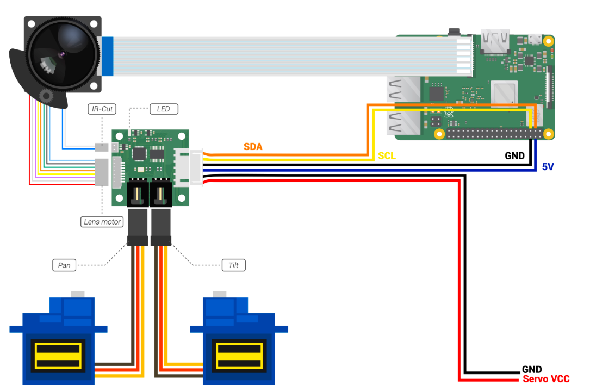

# PTZ Camera Controller for B016712MP

## Hardware Conncetion



## install dependencies

* sudo apt update
* sudo apt install -y libatlas-base-dev python3-opencv python3-picamera2
* python3 -m pip install -U numpy 


## Download the source code 

```bash
git clone https://github.com/ArduCAM/PTZ-Camera-Controller.git
```

## Add camera

* Edit the configuration file: sudo nano /boot/config.txt
* Find the line: camera_auto_detect=1, update it to:camera_auto_detect=0
* Added: dtoverlay=imx477
* Save and exit

## Enable i2c

<!-- * cd PTZ-Camera-Controller
* sudo chmod +x enable_i2c_vc.sh
* ./enable_i2c_vc.sh
Press Y to reboot -->
1. `sudo raspi-config`
2. select **Interface Options** and enter


3. select I2C and enter


4. Select YES and press enter to confirm


5. exit and reboot

## Run the FocuserExample.py

* cd PTZ-Camera-Controller/B016712MP
* python3 FocuserExample.py


## Run the AutofocusTableExample.py

* cd PTZ-Camera-Controller/B016712MP
* python3 AutofocusTableExample.py


### Generate autofocus configuration

The program will automatically read the autofocus file when it starts. If the file is not available, it will prompt the user to generate the autofocus configuration using the dedicated program.

When entering the program to generate the auto-zoom focus configuration, please ensure that the camera is fixed on the desired area for photography.

If the resulting configuration does not yield satisfactory results, press F to regenerate the configuration.

Tips: Please ensure a stable image when generating the AF table and disable automatic exposure and other functions.

## Refering the link to get more information about the PTZ-Camera-Controller

[Pan/Tilt/Zoom Camera](http://www.arducam.com/docs/cameras-for-raspberry-pi/ptz-camera/)